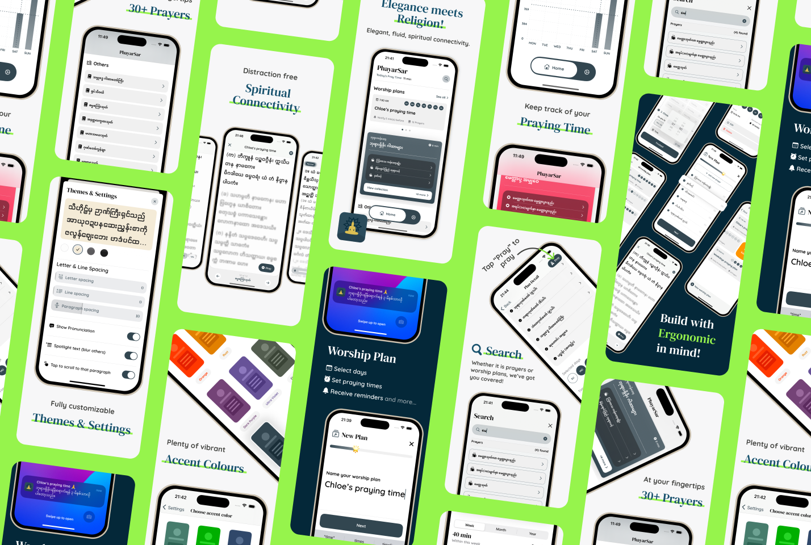
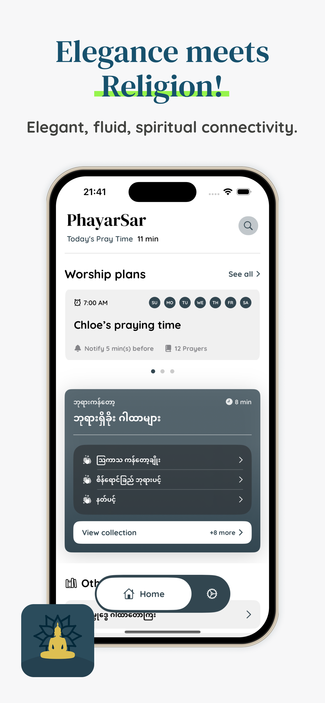
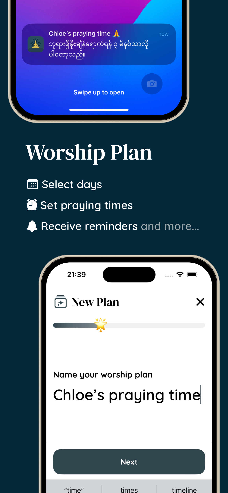
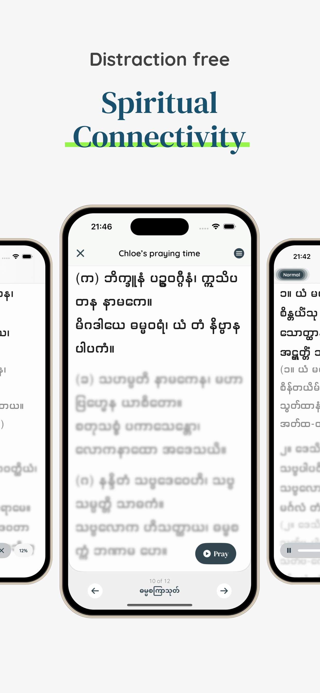
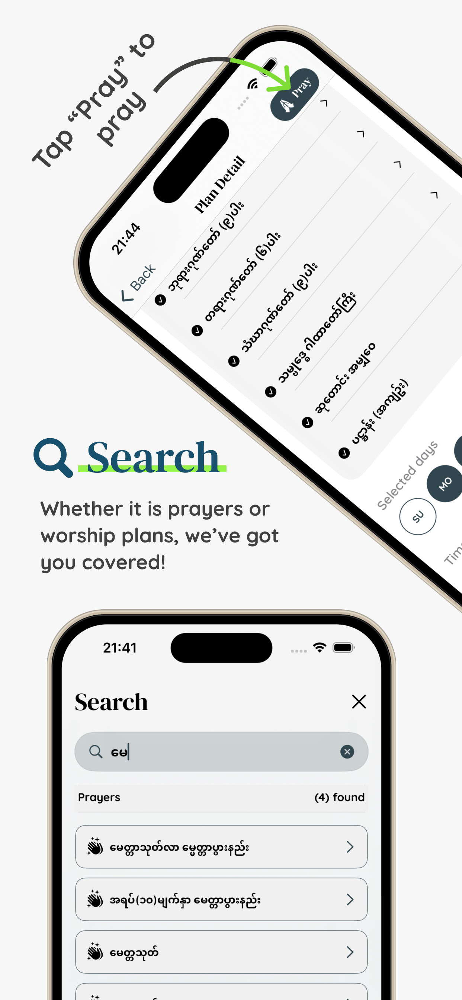
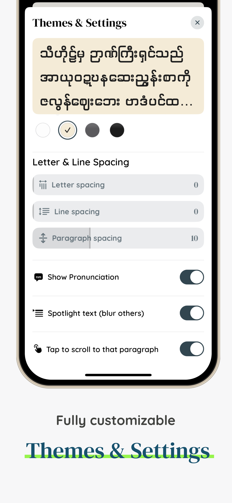
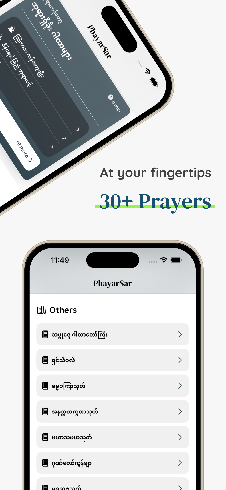
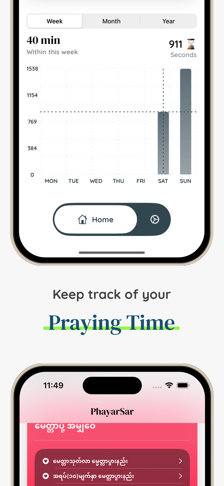
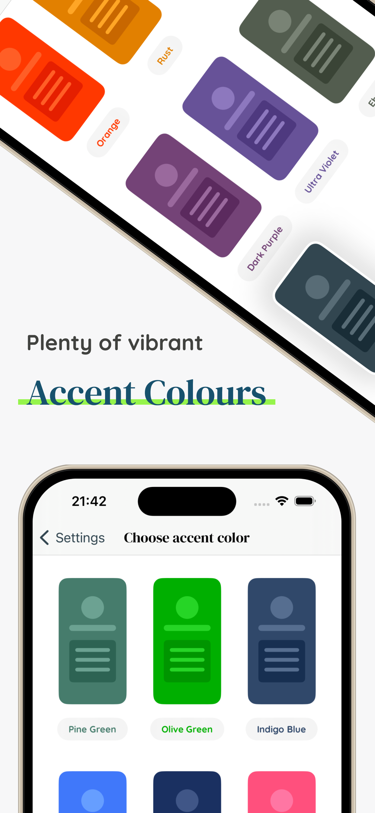

    

<h1 align="center">PhayarSar - Buddhist Prayers</h1>

    
    
    

  

  
  
  

  
  

  
  

  
  

PhayarSar is your ultimate companion for embracing Buddhist prayers and deepening your spiritual practice.

You can find it on the App Store 👇:

https://apps.apple.com/us/app/phayarsar-buddhist-prayers/id6475991817

## Features
With PhayarSar you can:
  
  Organize Prayers: Easily add and organize your prayers according to your preferences.

Customizable Schedule: Set prayer times and select specific days of the week for each prayer.

Reminder Notifications: Receive timely reminders before your scheduled prayer time to stay connected and focused.

Personalize Reading Experience: Tailor the app to your liking with customizable page colors, fonts, font sizes, line spacing, and letter spacing.

Optimal Reading Comfort: Adjust settings for an immersive and comfortable reading experience that suits your visual preferences.

Reader Mode: Dive deep into prayers with manual scrolling, allowing you to absorb each paragraph at your pace.

Player Mode: Enhance your reading flow with automatic scrolling, customizable to match your reading speed for a seamless prayer experience.

English and Myanmar: Access prayers in two languages, English and Myanmar, without any language barriers.

# Getting Started
Make sure you fulfill the requirements. 

You can clone this github repository on your computer and open it with Xcode. Or you can directly click on "Open with Xcode" from Github (see image below).

Once you open the project in Xcode, no additional set up is needed. Use the standard steps to:
- Build the project (Command+B)
- Run the project (Command+R)
